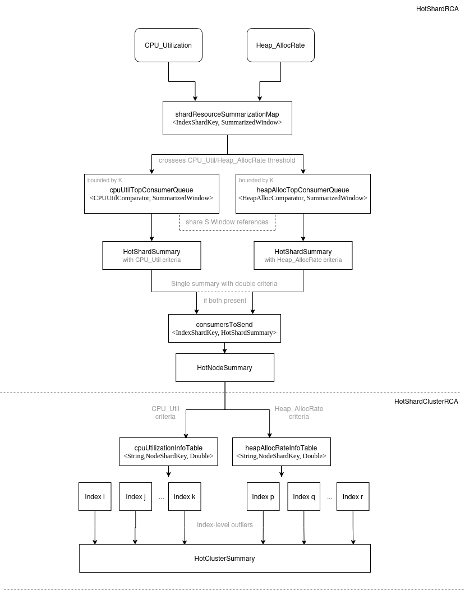

# Hot Shard RCA

## Definition

The idea behind HotShard RCA is to identify a hot shard within an index. A Hot shard is a resource
consuming outlier within its counterparts. The RCA subscribes to following metrics:

1. `CPU_Utilization`
2. `Heap_AllocRate`.

While there is only two of them, these metrics provide accurate picture of operation intensities for a 
certain shard like Bulk request - high heap allocation rate, Search request - high CPU utilization and for 
more complex queries also heap allocation rate, Document update - relatively high balance between these 
two metrics.
The RCA looks at the above two metric data and compares the values against the threshold for each
resource and if the usage for any of the resources is greater than their individual threshold, we
mark the context as 'UnHealthy' and create a `HotShardResourceSummary` for the shard.

In order to have a full picture of the index-level shard stats, and to detect outliers, cluster
variant - `HotShardClusterRCA` is to be used as a downstream RCA to the `HotShardRCA`s running on
each Data node.

In the future, some metric dependent on disk read/write intensity is to be considered, potential
candidates being:

1. `Thread_Blocked_Time`
2. `IO_TotThroughput `

## Implementation overview

In every RCA period, all existing shards are taken into account within this RCA. This number can
go up to 1000 per Node and thus create huge memory footprint for both the Cluster Manager and
Data nodes, if implementation is handled naively.

To minimize the core of the footprint (memory allocated for the whole duration of each RCA period
which directly scales with number of shards), a single map, mapping unique Index, Shard combination
to the highly specific structure, called `SummarizedWindow`, is used.

HotShardRCA period consists of `SLIDING_WINDOW_IN_SECONDS/5` (default being `12`) operate ticks,
each of them consuming metric aggregations from previous `5` seconds, more precisely the 5-second `SUM`
aggregation of each metric. `SummarizedWindow` accumulates these aggregation over the period
of `SLIDING_WINDOW_IN_SECONDS` (by default 1 minute) and is later used to calculate the over time
average of these accumulated metrics. Note that summarization would give us a little less
information than the average value as some shards may start or stop being active anywhere inside the
RCA period. This is why more general case structures like `SlidingWindow` offer us a granularity
that we don't need and by omitting them, considerable amount of heap is saved. Also, inside the same
single `SummarizedWindow`, all metrics are getting aggregated at once, this way eliminating
duplicated timestamps and shard identification data.

In high workload environments, there is a possibility for the worst case scenario, where all the
shards present on cluster become candidates and must be sent to the Cluster Manager thus
potentially creating high network traffic as well as very high heap usage on the Cluster Manager
node that is supposed to collect all the cluster data. To account for this possibility, Top-K
consumers heuristic is used.

Top-K consumers is setting a limit to a maximum number of Hot Shards being sent over the network to
the cluster Manager. This is also configurable through .conf files, default being `50`. The idea is
that we have a `K << N` for extreme `N`'s where `N` represents number of shards on Node.

The Top-K heuristic is done by triage-like process on map iteration. Each shard that crosses a
certain metrics threshold goes into one of two bounded `MinMaxPriorityQueue`s (a queue for each
metric, and their capacities limited by K parameter), note that one shard can end up in both queues
if both of its metrics cross their respective thresholds. This way, during the process, only the
consumers that have a chance of being sent to the Cluster Manager are being stored plus saving
memory and having a memory size - fixed structure under the queues' implementations. We also pass
references to the same `SummarizedWindow` structures to both queues and only give them different
comparator objects, this also saves heap. At the end, union of queues' elements is being created inside a 
single map, where corresponding criteria are assigned based on shards presence inside the maps. Values of 
this map will form the summaries sent to the `HotShardClusterRCA`. Note that due to reference sharing
all metric info is preserved even if consumer is present only in one queue after the triage.

As a final process for a Data node's `HotShardRCA`, data from queues is converted to Summary
objects that are sent to Cluster manager Node for the cluster variant of the analysis. These contain
Node, Index, Shard identification, relevant timestamps as well as metric value, threshold and type.

`HotShardClusterRCA`'s responsibility is to collect and triage the data, first by metric type, and
then by index. For each index, shards are sorted by metric values and the median value is
calculated. Hot shard criteria is following: All shards that are by threshold (which is in %) '
bigger consumers' than the median of all index shards, are declared hot and cluster health status
and summaries about the shards are created and persisted for later querying.

## Threshold tuning

`HotShardRCA` uses raw metric thresholds to determine the candidate Shards that are sent to the
Cluster manager node. There are no universal values that cover all the use-cases, workloads and
configurations and these should be set up and monitored carefully by cluster administrators.

As all metrics used by this RCA are time-related (usage ratio for previous period and alloc rate)
magnitude of metric values can vary based on multiple factors: type of operations performed on
cluster in previous periods, computing power of host machines, number of nodes.

We provide some benchmarks and conclusions that we base our default thresholds on.
Each of the following benchmarks was performed on an empty 2-node Docker-deployed clusters. The idea is
to perform some kind of operation (Bulk, Index, Search, Update) for each index, sequentially,
multiple times. In following runs, there is 500 indexes with 1 shard each (as we first look
at `HotShardRCA` only), where indexes from range `[300-399]` perform the concrete operation 10 times
more than the rest, this is to spot the behaviour of the raw metric values when intensity of
operation increases by order of magnitude.

First run is done by performing Bulk requests, 6500 documents for lower and 65000 for higher
intensity indexes. Bulk request is a good example for pushing Heap_AllocRate metric to its limits,
and here we see multiple shards crossing 1KB/s for mentioned metric.

Good candidate for high CPU_Utilization is the Search request run, in this run few shards even go above 0.1
usage ratio which is achieved by very intense Search request operations and as it will later be
seen, these results are hard to reproduce in some more realistic workloads.

Note that search request operations can also be Heap hungry in some more complex search scenarios where more
intermediate structures and processing is required during the search period.

In next batch of benchmarks we monitor results from `HotShardClusterRCA` runs.
For these we use 3-node Docker-deployed cluster with two Data nodes and one Cluster manager node
with no data on it. Now we are putting the load on 100 indexes with 5 shards each, where we plan
for, on average, 3 shards to cross the thresholds for `HotShardRCA` and to be sent to cluster variant of
analysis.

Next we present `Heap_AllocRate` and `CPU_Utilization` measurements respectively for previously
mentioned setup and Search request load. We specifically index the documents using `routing` and then perform
search requests.The `routing` query parameter is dependent on a pre-fixed distribution (distribution is
created such that one shard is always pushed to be an outlier).

Dots aligned on the same vertical lines belong to the same index. Bigger dots represent shards
declared Hot.
On both plots we can easily spot the hot shards, their counterparts and their respective values.
Shard 3 values do not even make it to the Cluster manager majority of times, while red dominate the plots 
as we made their usage frequency high with the previously mentioned distribution.

Based on these runs some compromising default initial thresholds can be derived, and we set these to `0.015` and `1.4E6` for 
`CPU_Utilization`
and `Heap_AllocRate` respectively.

